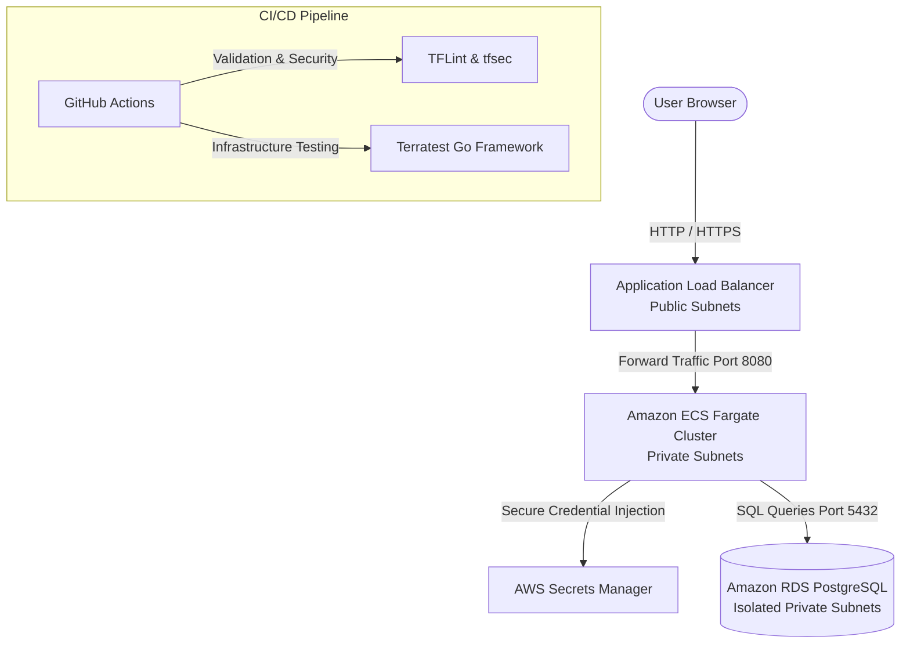

# Enterprise AWS ECS Fargate Backend API Architecture


Production-grade backend infrastructure hosted on AWS. Built using modular Infrastructure as Code (IaC) via Terraform, featuring secure container orchestration with Amazon ECS on Fargate, isolated relational persistence using Amazon RDS PostgreSQL, dynamic credential injection via AWS Secrets Manager, and automated quality gates with Terratest.

## System Architecture



Core Technical Highlights

    Serverless Container Orchestration: Production workloads run on Amazon ECS with AWS Fargate, eliminating server management while ensuring high availability across multi-AZ private subnets.

    Stateful Relational Persistence: Fully isolated Amazon RDS PostgreSQL instance deployed across private subnets with automated multi-AZ storage and secure security group boundaries.

    Dynamic Secret Management: Zero plain-text credentials; database authentication strings are securely stored in AWS Secrets Manager and injected directly into container memory at runtime.

    Automated Security & Testing Gates: Comprehensive CI/CD pipeline featuring Terraform static analysis (tflint, tfsec), syntax validation, and infrastructure integration testing (Terratest).

Repository Structure
```text

.
├── .github/workflows/
│   └── ci.yml                # CI/CD Validation and Security Pipeline
├── modules/
│   ├── database/             # RDS PostgreSQL, Subnet Groups, Secrets Manager
│   ├── ecs/                  # ECS Cluster, Fargate Task Definitions, IAM Roles
│   └── networking/           # VPC, Public/Private Subnets, NAT Gateway, ALB, SGs
├── tests/
│   └── ecs_backend_test.go   # Automated Infrastructure Testing via Terratest (Go)
├── main.tf                   # Root Module Orchestration
├── variables.tf              # Global Input Variables
├── outputs.tf                # Infrastructure Output Attributes
└── providers.tf              # Provider Configurations and Tags

```

Prerequisites & Setup

    AWS CLI configured with active administrator credentials.

    Terraform version >= 1.5.0 installed.

Execution Commands

    Initialize Terraform modules and providers:
    Bash

    terraform init

    Validate infrastructure syntax:
    Bash

    terraform validate

    Deploy enterprise infrastructure:
    Bash

    terraform apply -auto-approve

    Destroy environment (Zero-Cost Baseline):
    Bash

    terraform destroy -auto-approve

Cost Management Notice

    Zero-Cost Policy: This enterprise architecture provisions an Amazon RDS database and an AWS NAT Gateway which incur continuous hourly charges if left running. Always execute terraform destroy immediately after validation sessions.


## Architectural Decisions & Security (tfsec)

This repository is engineered to pass `tfsec` static analysis. However, specific security controls have been intentionally suppressed via inline exceptions to preserve a frictionless "clone-and-deploy" experience for reviewers:

*   **TLS/HTTPS Termination (Ignored `aws-elbv2-http-not-used`):** The Application Load Balancer defaults to HTTP (Port 80). Enforcing HTTPS requires provisioning an AWS ACM Certificate, which mandates domain ownership and DNS validation. This was omitted so reviewers can deploy the infrastructure immediately without providing a custom domain.
*   **Public ALB Exposure (Ignored `aws-elbv2-alb-not-public`):** The ALB is set to `internal = false`. While an enterprise backend API would typically reside behind a private API Gateway or CloudFront distribution, this ALB is public to allow direct browser verification of the Fargate containers without requiring the reviewer to configure a Client VPN or bastion host.
*   **Parameterized Security Groups:** Ingress CIDR blocks are not hardcoded. Reviewers can scope ALB access strictly to their own IP by overriding the `allowed_ingress_cidrs` variable in a `terraform.tfvars` file.
